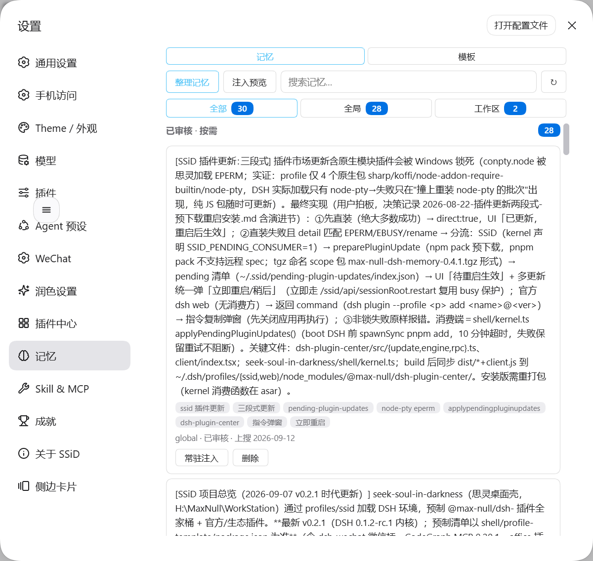

# dsh-memory

本插件属于 **`@max-null/*` 插件系列**——这一系列共同构成 **[SSID（思灵 · Seek Soul in Darkness）](https://github.com/Max-Null/seek-soul-in-darkness)** 桌面体验。SSID 是整合它们的盒：`dsh-capture` · `dsh-chat-rail` · `dsh-chinese-thinking` · `dsh-draft-polish` · `dsh-guardian` · `dsh-habit` · `dsh-memory` · `dsh-node-appearance` · `dsh-plugin-center` · `dsh-quick-toolbar` · `dsh-skill-mcp-center` · `dsh-ssid-panels` · `dsh-ssid-zh-ui` · `dsh-achievements`。

This plugin belongs to the **`@max-null/*` family** — a set of plugins that together form the **[SSID (思灵 · Seek Soul in Darkness)](https://github.com/Max-Null/seek-soul-in-darkness)** desktop experience.

一个面向 [DeepSeek Harness](https://github.com/deepseek-ai/deepseek-harness) 的**跨会话明文记忆插件**。遵循「一切皆插件」——它不修改 DSH 源码，声明 `name`/`inject`/`apply`，由 Loader 从 `cordis.yml` 加载。

## 设计原则

1. **写入即生效，人是例外干预者**：模型写入的记忆直接生效（`approved`），不再逐条等人放行；人保留随时查看、改写、删除、钉住或回滚的能力——人不在场不等于失控。
2. **可观测先于精准**：每条记忆是明文，`memory_list` 随时可见、`memory_forget` 随时删除——不存在"静默暗礁"。
3. **明文是人机共享的审计窗口**：记忆是可读文本，模型可自检其是否过期（有效性锚点会在所绑环境值变化后标记 `stale`），人可随时查看与改写。
4. **确定性且缓存安全**：BM25 关键词检索是存储的纯函数、无 LLM 调用；固定指引进 system-prompt section，`approved + injected` 记忆进 recall context（global 全量 + 当前会话工作区），逐条为单行摘要并按注入预算截断（超预算按最近使用优先，省略数在面板可见）。

## 截图

装完后在设置里多出「记忆」一项，可查看与管理跨会话记忆：

**入口：** 设置 → 记忆

| 设置入口与面板 |
|---|
|  |


## 用法

```bash
npm install @max-null/dsh-memory
```

在你的 `cordis.yml` 加一条（其余 storage / system-prompt / tools 由宿主已有；记忆的存储后端由插件自己注册）：

```yaml
- id: memory
  name: '@max-null/dsh-memory'
```

## 提供的服务与工具

- **服务** `ctx.memory`：`remember` / `list` / `search` / `forget` / `setStatus`
- **工具**：`memory_save`、`memory_list`、`memory_search`、`memory_confirm`、`memory_forget`、`memory_update`
- **注入**：`tool:memory` 指引 section（工具用法 + 常驻注入判据）+ `memory:self` 机制自述 + `memory:recall` 召回 context（global 的 `approved + injected` + 当前会话工作区的 `approved + injected`，带 `[memory:<id>:<namespace>]` 来源标记；摘要化 + 预算截断）
- **检索**：BM25（CJK 单字 + 2-gram，content 与 keywords 字段分离加权；中文多字查询精度显著优于单字切分）；可选语义融合（见「可选配置」）

## 两层存储（global / project）

记忆按 `namespace` 分两层物理存储，各落在独立的明文 JSON：

| namespace | 默认位置 | 用途 |
|---|---|---|
| `global` | `$DSH_HOME/storages/memory.json` | 跨项目的个人偏好 |
| `project` | `<cwd>/.dsh/storages/memory_project_<hash>.json` | 跟随仓库的项目共识，可 git 分享 |

两个根都可用 config 覆盖（`globalRoot` / `projectRoot`）。`memory_list` / `memory_search` 不带 `namespace` 过滤时会同时查两层。旧版双重前缀文件名（`memory_project_memory_project_<hash>.json`）在打开时自动迁移为规范名。

## 跨工作区可见性（0.10.0）

project 记忆按**会话工作区**分文件存放，所以「工作区」就是可见性的边界。0.10.0 起补了三个方向——针对的是同一个盲区：**不知道存在**（检索是有意图的动作，搜不出自己不知道存在的东西）。

| 方向 | 机制 | 效果 |
|---|---|---|
| 向上 | **祖先链** | 在子目录里开会话能检索到父目录的记忆（反向不行，链是单向向上的），结果带 `..` / `../..` 来源标记 |
| 向下 | **子项目索引行** | 注入里多一行「本工作区下另有 N 个子项目带记忆：xxx（M 条）——用 memory_search 检索」 |
| 全局 | **记忆索引行** | 注入里多一行「索引：当前可见 N 条记忆，主题集中在 X(14)、Y(12)…——用 memory_search 检索」 |

三条边界：**写入永远只落当前工作区**（「我在这个项目里记的东西」不该被推理到别处）；但**检索得到的记录就改得动**——`memory_update` / `memory_forget` 同样沿链定位；**注入路径只读当前工作区**（远处的记忆进检索、不进每轮成本）。

后两行**不占注入预算**、自消除（没有内容时整行不出现），且**长度常数级**——不随记忆增长。索引行里的主题取自各条的关键词词频，与检索用的是同一套词汇，所以**索引里出现的词就是能搜到的词**。

**孤儿文件清点**：`node scripts/scan-orphans.mjs [根目录]` 报出「哪些记忆文件当前代码已经打不开」（历史命名遗留：早期无哈希后缀、双重 `memory_project_` 前缀）。**只读，不做任何处置**——旧文件可能含未过隔离检查的内容，处置需人工拍板。

**祖先链诊断与探针**：`node scripts/ancestor-probe.mjs plan [--cwd <会话 cwd>]` 只读地复算该 cwd 的祖先链（哪些层级带记忆文件、引擎会纳入几级），并回答「这个 cwd 上祖先链是否**可观测**」——若以上祖先层都没有记忆文件，祖先链生效与否行为逐字相同，那是个零差异的观测点。要实测检索侧跨链，用 `seed` / `check` / `clean` 在祖先层造一条临时探针再撤销。**前提**：探针只对**没打开过该层**的会话有效——引擎的表打开即缓存，而写路径的新鲜度门（`refreshForWrite`）只比对 global 与当前 cwd，**不含祖先层**，被缓存过的层会用陈旧内存态覆盖掉外部写入。

## 多实例共存（0.7.1）

两个 DSH 实例（例如 DSH web 与 SSiD 桌面壳）可以同时运行、共用同一个 `DSH_HOME`，**记忆不再互相抹掉**。

DSH 存储层的写入是「读—改—写全量覆盖」，且官方两个后端都声明不做跨进程协调（`storage-json`：*writer per process and last-write-wins is correct*；`storage-sqlite`：*cross-process coordination is out of scope*）。插件层的处置是**写前重读**（等价于 update 前先 select）：每次写入在串行区里先比对存储文件指纹（mtime + size），发现磁盘被别的实例动过就先重载再写。代价是磁盘没变时的一次 `statSync`。

残余窗口只剩两个实例在**同一瞬间**写——此时后写者赢；同时写**不同**记忆已不再互相影响。

**未覆盖**：`workspace.json`（工作区登记）由 DSH 自己的 workspace 服务写，插件层够不着，仍会被双实例互相覆盖；根因处置在上游——[discussion #6882](https://github.com/deepseek-ai/deepseek-harness/discussions/6882)。当前防线是轮转快照备份（SSiD 侧 `shell/scripts/backup-storages.mjs` + 计划任务）。

## 使用流程（写入即生效，人为例外干预）

提示词模板库（0.6.0）：`prompt_search / prompt_get / prompt_list / prompt_add` 四个工具管理**模板库**——
md 文件是唯一事实源（`~/.dsh/prompt-library/*.md` 为 global；`<workspace>/.dsh/prompt-library/` 随工作区分享），
前端（记忆面板「模板」tab / 模型工具）检索同一份索引；模板存在即生效（`source: agent` 角标标识模型新增），
**永不注入 system prompt**。

```
模型 memory_save     →  status: approved，立即生效；命中密钥/凭据规则则隔离（不进检索也不进注入）
                        给 injected 则同时钉住常驻（0.8.0），不吃下面两条自动规则
memory_search        →  关键词/语义召回（只搜记忆；模板走 prompt_search 通道，不会混进候选池）
命中累计 2 次         →  injected: true（自动打开常驻：global + 当前会话工作区，摘要化 + 预算截断）
30 天未再命中         →  自动撤下常驻（只撤自动开的；人工或模型显式动过的开关双向豁免）
人（面板 / 开关）     →  钉住 / 删除 / 放行隔离记录 / 回滚
memory_forget        →  随时删除（删除始终是人的动作）
```

两条自动规则撑起淘汰机制：**反复被检索命中**是它值得每轮付费的证据，**长期不再被命中**则自动退出常驻。两者都不删除任何内容——记忆不会无限累积，也不会被系统自行清空。

自动规则对**低频但关键**的记忆（长期约定、判据、委托）够不着：它们不会被反复检索，够不到阈值；勉强够到也会被 30 天撤下。这类走显式路径——在 `memory_save` / `memory_update` 里给 `injected` 即钉住，写的是与面板开关同一套语义（`injectedAuto: false`），此后不受两条自动规则影响。未审核与已隔离的记录不接受注入。

注入有**字符预算**（默认 1500，config `injectionBudget`）：装不下的条目**整条丢弃**（不截内容），按「最近更新优先」取舍——所以 `injected: true` 不等于「每轮真的在场」，它只保证有资格排队。0.9.0 起这种出局不再无声：注入末尾会追加一行 `（另有 N 条常驻因预算未注入：…）`，0.9.1 起列出的是**每条的短摘要**而不是 id——查 id 是什么的那一步最容易省略，省略了就等于没报；**清理干净即自行消失**。面板的注入预览里也能展开看明细。诊断行本身不占预算。

记忆还可声明**有效性锚点**（环境变量 / 工具清单 / 插件版本）：所绑的值变化后，这条记忆被标记 `stale` 并撤下常驻，检索结果里也带出失效提示——环境变了，旧结论就不再被当成仍然正确。

模型写入不需要人点头，但**人始终能看见并推翻**：面板按「隔离区 / 常驻 / 冷数据」分组，被隔离的记录必须由人放行才会重新进入检索。

## 为什么明文 + BM25，而不是向量检索

向量检索的记忆本体是一串不可读的数字，过期信息会成为**无法观测、无法修复的静默暗礁**；BM25 + 明文让每一次召回都可解释、每一条记忆都可见可删。语义（向量）检索作为**可插拔的可选项**（0.5.2，见「可选配置」）——记忆本体仍是明文，向量仅作为检索辅助字段（`vector`，明文可读），且以"可观测 + 可修复"为门槛。

明文还有一层**跟随仓库分享**的好处：`project` 命名空间的记忆落在项目文件夹内（`<cwd>/.dsh/storages/memory_project_<hash>.json`），随 `git` 提交、分享给所有协作者；`global` 命名空间的记忆留在本地 `$DSH_HOME`。团队的共识（"本项目统一用 Vue3 `<script setup>`"）能沉淀进仓库，而不是散落在每个人的本地。FTS5 的 SQLite 二进制无法这样"跟着仓库走"。

## 可选配置

在 `cordis.yml` 的 `config` 里传给插件（均可省略）：

```yaml
- id: memory
  name: '@max-null/dsh-memory'
  config:
    injectionBudget: 1500        # 常驻注入预算（字符；null = 不限制）
    summaryChars: 80             # 单条注入摘要截断上限（字符）
    semanticTopK: 5              # 语义侧参与融合的 topK（仅配置 embeddings 时生效）
    # 混合语义检索（可插拔；缺省 = 纯 BM25）
    # embeddings: { embed: '...' 提供 embed(texts) 的宿主函数 或 插件名 ... }
```

`embeddings` 接受 `{ embed(texts): Promise<number[][]>, similarity? }` 对象——由宿主装配层提供嵌入实现（如 DeepSeek 嵌入端点）；配置后 `memory_search` 以 BM25 + 语义 RRF 融合，向量增量生成并持久化，嵌入调用失败自动降级为纯 BM25。

## SSID 系列

本插件是 **[SSID（思灵 · Seek Soul in Darkness）](https://github.com/Max-Null/seek-soul-in-darkness)** 全家桶的一员；也可以单独安装到任意 DSH profile——除设置页的记忆面板外不依赖其它同系列插件。

## 开发

```bash
npm install
npm run typecheck   # tsc 严格类型检查
npm test            # vitest 单测
npm run build       # 产出 dist/
node scripts/verify-loader.mjs   # 用 Loader 端到端验证插件可加载
node scripts/scan-orphans.mjs [根目录]       # 清点「当前代码打不开」的记忆文件（只读）
node scripts/unzstd-frames.mjs <源> <目标>   # 解多帧 zstd（读 DSH 会话日志用）
node scripts/ancestor-probe.mjs plan [--cwd <cwd>]   # 复算祖先链（只读）；seed/check/clean 验 ④-A
```

## 依赖（peerDependencies，由宿主提供）

`@deepseek-ai/cordis`、`@deepseek-ai/dsh-storage`、`@deepseek-ai/dsh-storage-domain`、`@deepseek-ai/dsh-storage-json`、`@deepseek-ai/dsh-system-prompt`、`@deepseek-ai/dsh-tools`
